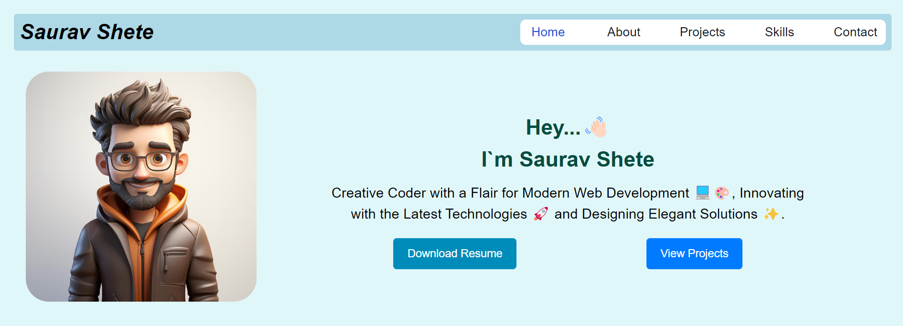

# Portfolio

## Description

This is my portfolio website where I showcase my Resume, Projects, and Skills. The purpose of this project is to demonstrate my abilities in web development, particularly my design skills. The portfolio is built primarily using <b>React.js</b>, <b>JavaScript</b>, and styled with <b>Tailwind CSS</b>.

## Features

<ul>
<li>
<b>Project showcase </b> : Display previous projects with links , descriptions ,images and dates
</li>
<li>
<b>Skills section</b> : Highlights our Technical and Soft Skill
</li>
<li>
<b> Contact Section</b> : Provide a contact form or links to your social media.
</li>
<li>
<b>Resume</b> : Display a downloadable resume.
</li>
<li>
<b>Responsive design </b>: The website is optimized for mobile and desktop devices, ensuring a great user experience on all platforms.
</li>
</ul>

## Screenshots

## Contact
If you want to contact me you can email me at sauravshete72@gmail.com  or follow me on https://www.linkedin.com/in/saurav-shete 😊.